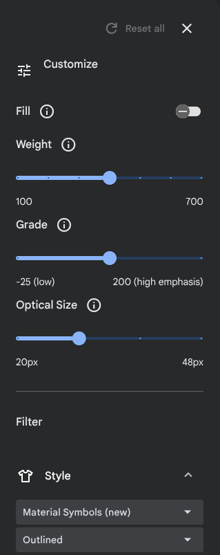
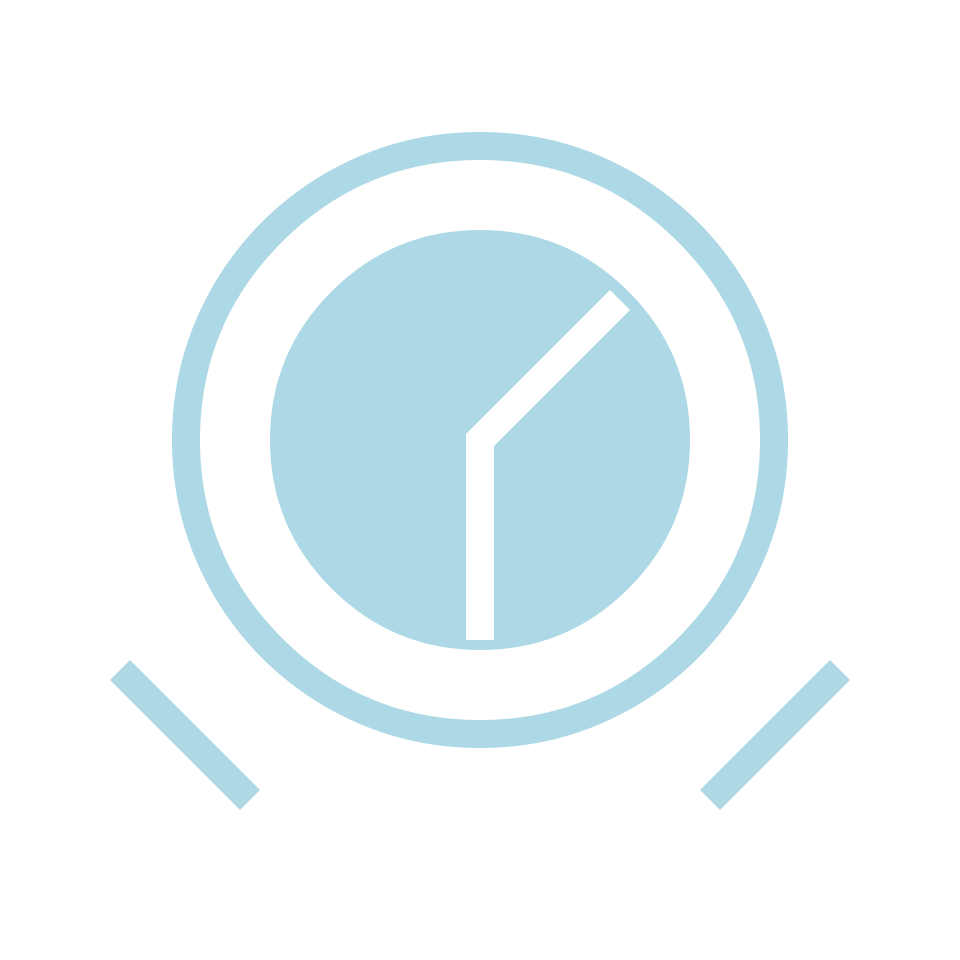

# Introduction to accessing fonts in Rust with Skrifa

Learn to generate an Android [Vector Drawable](https://developer.android.com/develop/ui/views/graphics/vector-drawable-resources)
from a [variable](https://medium.com/variable-fonts/https-medium-com-tiro-introducing-opentype-variable-fonts-12ba6cd2369) icon font.

## Logistics

It is assumed that all code is cloned into the same directory and that [`cargo new`](https://doc.rust-lang.org/cargo/commands/cargo-new.html) is run in that directory.

At times only partial commandline output is given to reduce noise.

## Install Rust

See [https://www.rust-lang.org/tools/install](https://www.rust-lang.org/tools/install)

If you haven't written Rust **at all** so far take the time to complete at least one of:

1. Microsoft [Rust first steps](https://learn.microsoft.com/en-us/training/paths/rust-first-steps/)
   * 0.5 to 1.0 days
1. Google [Comprehensive Rust](https://google.github.io/comprehensive-rust/)
   * 4+ days, can be consumed in small chunks

## Get an editor

[VSCode](https://code.visualstudio.com/) with [rust-analyzer](https://code.visualstudio.com/docs/languages/rust)
is a good default if you don't already have a favorite.

## Get some icon fonts

Clone [https://github.com/google/material-design-icons](https://github.com/google/material-design-icons)

It's big, give it a minute :) In `` you'll find the variable fonts that contain all variants of all icons
shown at https://fonts.google.com/icons. When Style is set to "Material Symbols" The "Customize" options there are actually manipulating the axes of the variable font:



## Generate a Vector Drawable

### Create a CLI tool

```shell
# Create a new binary project
$ cargo new font2vd
     Created binary (application) `font2vd` package
2 directories, 2 files
$ cd font2vd
$ cargo run
Hello, world!
```

**Subsequent instructions assume you are in the root of font2vd**

### Error handling

Let's take this slightly more seriously than [font103](../font103) and try to avoid `unwrap` and `expect` for the most part.

* Add a dependency on [thiserror](https://docs.rs/thiserror/latest/thiserror/) (`cargo add thiserror`)
* Setup an enum for errors encountered producing vector drawables.
   * It can be setup exactly as the `thiserror` example shows, have no entries for now, and be called something creative like `VectorDrawableError`.
* Change your main function to return `-> Result<(), VectorDrawableError>`
   * The compiler will complain, add `Ok(())` as the final line of main
   * Now might be a fine time to read about the [unit type](https://doc.rust-lang.org/std/primitive.unit.html)

Make sure you can `cargo run` before proceeding.

Stuck? See [1-errortype.rs](./1-errortype.rs).

### Command line args

Add a dependency on clap (`cargo add clap --features derive`) and setup an args structure with two arguments:

1. A string that is a position in designspace
   * We'll be using this to construct a [`Location`](https://docs.rs/skrifa/latest/skrifa/instance/struct.Location.html) using [`AxisCollection::location`](https://docs.rs/skrifa/latest/skrifa/struct.AxisCollection.html#method.location)
   * A comma-separated list of axis tag : value pairs could work on the command line
   * Since variable fonts have a well defined default location you could mark it as allowed to default by adding `, default_value = ""`
      * E.g. `#[arg(short, long, default_value = "")]`
1. A path to an icon font
   * We'll be using this to construct a [`FontRef`](https://docs.rs/skrifa/latest/skrifa/struct.FontRef.html)

Try `cargo run -- --help`. It should print help about your commandline arguments.

What's with the `-- --help`? - the stuff before the `--` is arguments to Cargo, after is arguments to your program. See the `cargo run` [docs](https://doc.rust-lang.org/cargo/commands/cargo-run.html#description).

Stuck? See [2-args.rs](./2-args.rs).

### Load the font with error handling

Load the font specified in your args structure into memory, perhaps using [`std::fs::read`](https://doc.rust-lang.org/std/fs/fn.read.html). If that fails you'll get a [`std::io::Error`](https://doc.rust-lang.org/std/io/struct.Error.html). Alas, our `main`
returns `VectorDrawableError`. Add a variant to `VectorDrawableEror` that can hold an io error. It should look like the `Disconnect` variant shown in the [thiserror](https://docs.rs/thiserror/latest/thiserror/) example. Use [`Result::map_err`](https://doc.rust-lang.org/std/result/enum.Result.html#method.map_err) to convert the error type and the error propagation operator [`?`](https://doc.rust-lang.org/reference/expressions/operator-expr.html#the-question-mark-operator) to handle the error.

Try running your program and pointing it at a path you can't read. It should print something akin to:

```shell
$ cargo run -- --pos wght:0 --file not-real
Args:
Args {
    pos: "wght:0",
    file: "not-real",
}
Error: ReadFont(Os { code: 2, kind: NotFound, message: "No such file or directory" })

```

Stuck? See [3-fileerror.rs](./3-fileerror.rs).

### Create a FontRef

Add a dependency on skrifa (`cargo add skrifa`).

Create a [`FontRef`](https://docs.rs/skrifa/latest/skrifa/font/struct.FontRef.html), passing in your data as a u8 [slice](https://doc.rust-lang.org/reference/types/slice.html). `FontRef::new` returns a `Result` with a new error type. You'll have to add a variant to `VectorDrawableError` and use `map_err` again.

Just to confirm it's working you could print the variable font axes by calling [`.axes()`](https://docs.rs/skrifa/latest/skrifa/trait.MetadataProvider.html#method.axes) on your [`FontRef`](https://docs.rs/skrifa/latest/skrifa/struct.FontRef.html) (it helpfully implements [`MetadataProvider`](https://docs.rs/skrifa/latest/skrifa/trait.MetadataProvider.html)). This will give you the axes and ranges declared in the [fvar](https://learn.microsoft.com/en-us/typography/opentype/spec/fvar) table in [user units](https://github.com/googlefonts/fontc/blob/main/resources/text/units.md).

### Set the location in variation space

Parse the String location into the input we need to call [`location`](https://docs.rs/skrifa/latest/skrifa/struct.AxisCollection.html#method.location). Hints:

   * The example input `[("wght", 250.0), ("wdth", 75.0)]` is an array of tuples of `&str`, `f32`
   * `String` has a very nice [`split`](https://doc.rust-lang.org/std/primitive.str.html#method.split) method
      * It gives you an [`Iterator`](https://doc.rust-lang.org/std/iter/index.html) over the results
   * Use [adapters](https://doc.rust-lang.org/std/iter/index.html#adapters) to convert to your desired type
   * [`collect`](https://doc.rust-lang.org/std/iter/trait.Iterator.html#method.collect) the result into a [`Vec`](https://doc.rust-lang.org/std/vec/struct.Vec.html)
   * [https://doc.rust-lang.org/rust-by-example/error/iter_result.html](https://doc.rust-lang.org/rust-by-example/error/iter_result.html) gives examples of handling errors with iterators

It might be worth iterating on. Writing a for loop over the split and push results into a mutable vector might feel natural
depending what language(s) you are most familiar with.

Print the debug representation once you have parsed the location. It should look something like this:

```shell
$ cargo run -- -p wght:100,FILL:0.75 -f ../material-design-icons/variablefont/MaterialSymbolsOutlined\[FILL\,GRAD\,opsz\,wght\].ttf
Args {
    pos: "wght:100,FILL:0.75",
    file: "../material-design-icons/variablefont/MaterialSymbolsOutlined[FILL,GRAD,opsz,wght].ttf",
}
Location { coords: [0.75, 0.0, 0.0, -1.0] }
```

Note that Location is in [normalized units](https://github.com/googlefonts/fontc/blob/main/resources/text/units.md).

Stuck? See [4-split.rs](./4-split.rs).

### Find the Glyph ID of our icon

Oh wait, we haven't actually identified a glyph! Google-style icon fonts have two ways to access a glyph:

1. By ligature, e.g. "alarm" will resolve to the glyph for the alarm icon
1. By codepoint, each unique icon name is assigned a single [private-use area](https://en.wikipedia.org/wiki/Private_Use_Areas) codepoint

Resolving ligatures is slightly fiddly so lets go with codepoint for now. Add a commandline argument to specify the codepoint. Since
things like https://fonts.corp.google.com/icons tend to give the codepoint in hex you might want to support inputs like 0xe855 (the codepoint for alarm).

Once you've got your codepoint resolve it to a glyph identifier using the charactermap, just like in [font103](../font103).

Stuck? See [5-gid.rs](./5-gid.rs).

### Draw an svg

Before we make a Vector Drawable let's draw an SVG so we can look at it in a browser and confirm the expected result.

In a stunning stroke of luck Skrifa has an [example](https://docs.rs/skrifa/latest/skrifa/outline/index.html) of drawing an svg path. Implement your own pen:

1. Import [`OutlinePen`](https://docs.rs/skrifa/latest/skrifa/outline/trait.OutlinePen.html)
1. Create a new struct that owns a [`BezPath`](https://docs.rs/kurbo/latest/kurbo/struct.BezPath.html) (e.g. `struct BezPen(BezPath);`)
1. Implement the OutlinePen trait for your struct
   * Map the calls directly to BezPath, e.g. on `move_to` call [`BezPath.move_to`](https://docs.rs/kurbo/latest/kurbo/struct.BezPath.html#method.move_to)

You can then create your pen, draw into it, get the BezPath from it,
and call [`BezPath::to_svg`](https://docs.rs/kurbo/latest/kurbo/struct.BezPath.html#method.to_svg) to get the path.

To display an svg we'll need to wrap some boilerplate around our path. Notably, we'll have to specify the rectangular region of svg space we want to look at via the [viewBox](https://developer.mozilla.org/en-US/docs/Web/SVG/Attribute/viewBox) attribute. Conveniently Google style icon fonts draw into a square space starting at 0,0 and extending to (upem, upem). You can get upem from the [head](https://learn.microsoft.com/en-us/typography/opentype/spec/head) table by calling [`.head()`](https://docs.rs/read-fonts/latest/read_fonts/trait.TableProvider.html) on your `FontRef`.

Write a string to stdout similar to:

```xml
<svg viewBox="0 0 1024 1024" xmlns="http://www.w3.org/2000/svg">
   <path d="M ... Z"/>
</svg>
```

Try out your svg, a browser can render it. If all went well you should see your icon ... but upside-down:



Blast! Turns out fonts are y-up and svg is y-down. Luckily kurbo (`cargo add kurbo`) has an [`Affine`](https://docs.rs/kurbo/latest/kurbo/struct.Affine.html) implementation and there is a [`BezPath::apply_affine`](https://docs.rs/kurbo/latest/kurbo/struct.BezPath.html#method.apply_affine) method. [`Affine::FLIP_Y`](https://docs.rs/kurbo/latest/kurbo/struct.Affine.html#associatedconstant.FLIP_Y) will correct our clock but ... then the content with stretch from (0, -upem) to (upem, 0). To fix that do one of:

1. Write the viewBox for where the content is now
1. Move the content back up using [`Affine::then_translate`](https://docs.rs/kurbo/latest/kurbo/struct.Affine.html#method.then_translate)
   * Or building the appropriate Affine some other way

You should now have an svg of your icon!

Hint:

   * If you have never run into an affine (aka transform) before 3blue1brown's [Essence of linear algebra](https://www.youtube.com/playlist?list=PLZHQObOWTQDPD3MizzM2xVFitgF8hE_ab) is highly recommended, particularly the first couple chapters

Stuck? See [6-svg.rs](./6-svg.rs).

### Draw a vector drawable

It's just a slightly different xml wrapper. See [Vector images](https://developer.android.com/develop/ui/views/graphics/vector-drawable-resources) in the Android documentation.

Write one and try it out in Android Studio. Put it in `app/src/main/res/drawable` with the extension `.xml` and use it in an Android application.


